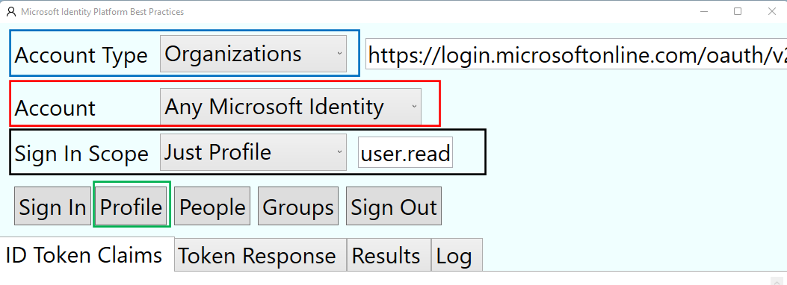
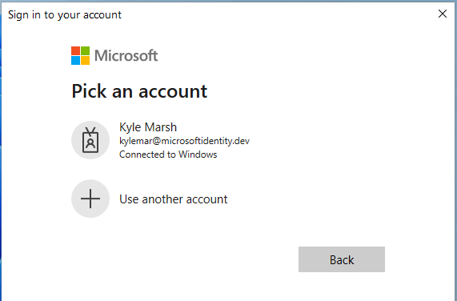
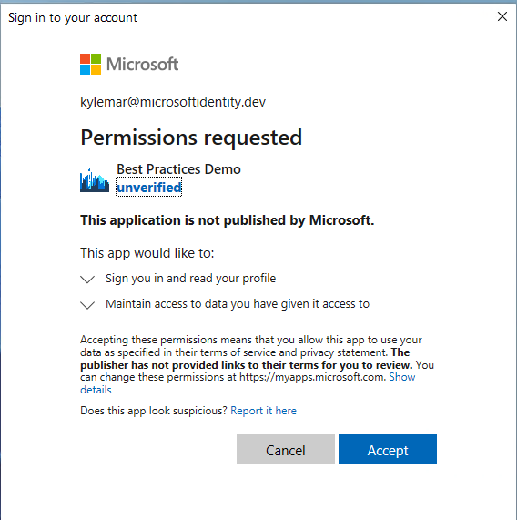
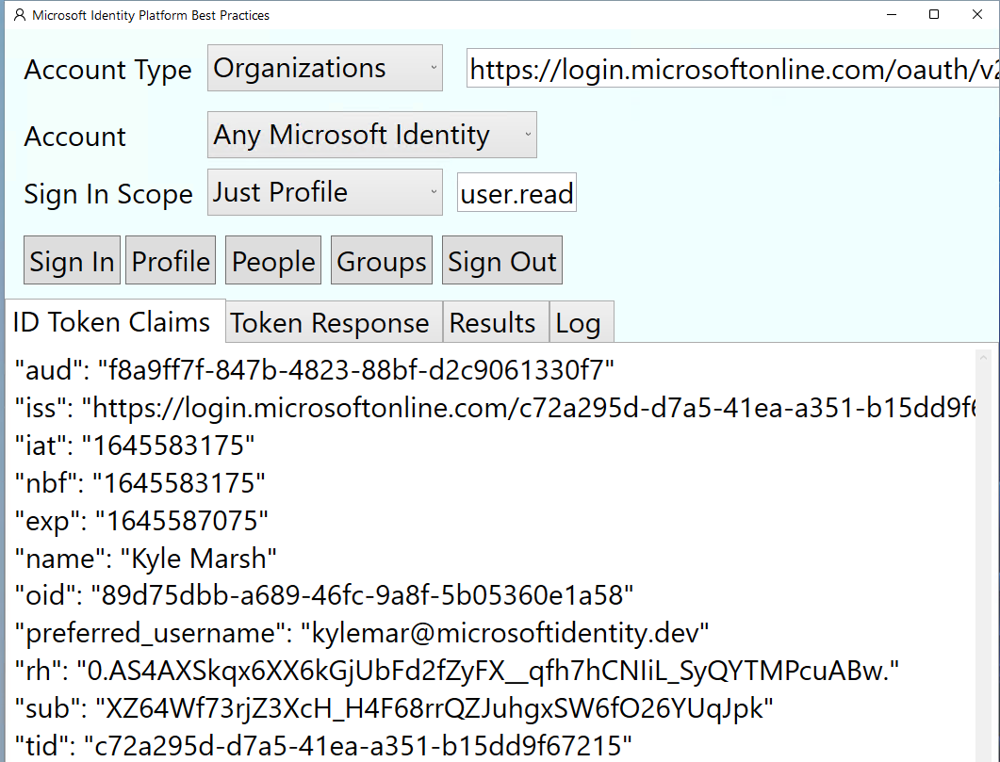
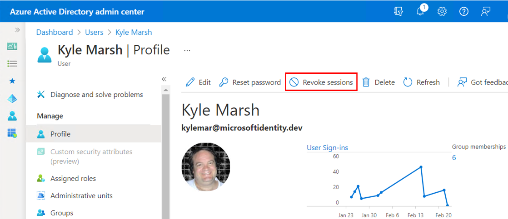
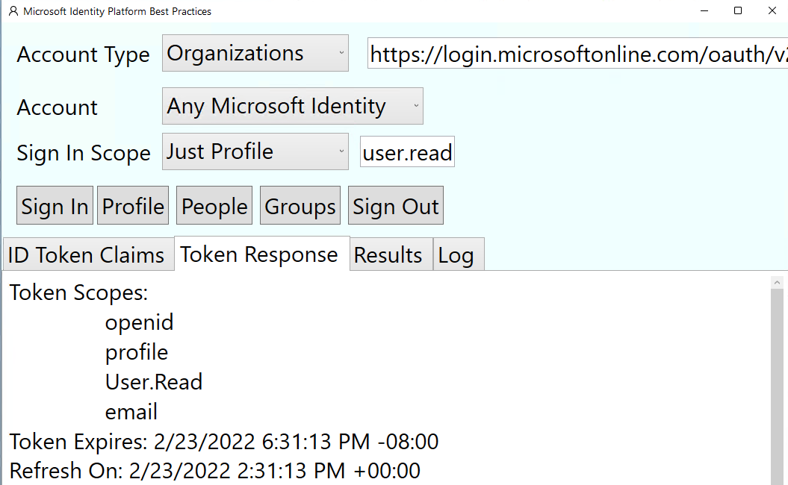

# Implemeting CAE on the client application with MSAL.NET library. 

## About this Demo

### Scope of this demo

In this demo, you will learn, how to implement CAE feature in the client application via MSAL.NET library. This is a WPF application which is making call to the GRAPH API. 

### Details of the demo – How it works 

#### How to run this sample 

Pre-requisites
1.	Install .NET framework for Windows by following the instructions at https://dotnet.microsoft.com/en-us/download/dotnet-framework/net48which 
2.	Install Visual Studio - https://visualstudio.microsoft.com/downloads/
3.	A user account in your Azure AD tenant, or a Microsoft personal account

#### Step 1: Clone or download this repository

From your shell or command line:

```Shell
git clone https://github.com/kylemar/BestPracticesDemo.git
cd "BestPracticesDemo"

```

or download and extract the repository .zip file.

> Given that the name of the sample is quite long, and so are the names of the referenced NuGet packages, you might want to clone it in a folder close to the root of your hard drive, to avoid file size limitations on Windows.

#### Step 2: Open the project in Visual studio and run it. 

Once you download the sample, open the solution file in visual studio and after successful rebuild, debug/run the sample. The following window should appear and select the highlighted(Different colors) options in the popup.

 
 
 
#### Step 3: Initiate authetication from the app.

Click on the Sign-in button which should bring the authentication page as below.

 
 

#### Step 4: Consent the app

Select the user against which you want to make the API call. If you are using the app for the first time, then it would ask the consent as below. Click on Accept button.

 
 
#### Step 5: Inspect thge claims

Now on the main window click on the profile button and it should show the claim as below

 
 
#### Step 6: Verify the token validity

Click on Token response button and observe the “Token expires” value. It will be valid for 24 hours unlike normal scenario where access token is valid only for 60 minutes. 

 

#### Step 7: Invalidate the user session 

Now visit Azure portal and select the user with against which you have signed into the app. Then revoke the existing session.  

 
 
 #### Step 8: Observe how CAE feature kick-in
 
 Wait for 10 minutes and click on the profile button again. Since CAE is enabled, it will ask the user to enter the credential again. 
 
 ### Code – How it works
 
 From the code perspective application is connecting to graph API. If the CAE checkbox is enabled, then application is updating the below code to enable the feature.
 
   ```csharp
            if (true==CAE.IsChecked)
            {
                builder.WithClientCapabilities(new[] { "cp1" });
            }
  ```

After revoking the session in the Azure portal, when you click on the profile button, the access token gets invalidated. The below code is handling the scenario.

APIrequest.Headers.Authorization = new System.Net.Http.Headers.AuthenticationHeaderValue("Bearer", token);
                APIresponse = await httpClient.SendAsync(APIrequest);
        
        ```csharp
                if (APIresponse.IsSuccessStatusCode)
                {
                    var content = await APIresponse.Content.ReadAsStringAsync();
                    var expandedContent = content.Replace(",", "," + Environment.NewLine);
                    return expandedContent;
                }
                else
                {
                    if (APIresponse.StatusCode == System.Net.HttpStatusCode.Unauthorized
                        && APIresponse.Headers.WwwAuthenticate.Any())
                    {
                        AuthenticationHeaderValue bearer = APIresponse.Headers.WwwAuthenticate.First
                            (v => v.Scheme == "Bearer");
                        IEnumerable<string> parameters = bearer.Parameter.Split(',').Select(
                            v => v.Trim()).ToList();
                        var error = GetParameter(parameters, "error");

                        if (null != error && "insufficient_claims" == error)
                        {
                            var claimChallengeParameter = GetParameter(parameters, "claims");
                            if (null != claimChallengeParameter)
                            {
                                var claimChallengebase64Bytes = System.Convert.FromBase64String(
                                    claimChallengeParameter);
                                var ClaimChallenge = System.Text.Encoding.UTF8.GetString(
                                    claimChallengebase64Bytes);

                                var newAccessToken = await GetAccessTokenWithClaimChallenge(
                                    scopes, ClaimChallenge);
                                if (null != newAccessToken)
                                {
                                    var APIrequestAfterCAE = new HttpRequestMessage(
                                        System.Net.Http.HttpMethod.Get, url);
                                    APIrequestAfterCAE.Headers.Authorization = 
                                        new System.Net.Http.Headers.AuthenticationHeaderValue(
                                            "Bearer", newAccessToken);

                                    HttpResponseMessage APIresponseAfterCAE;
                                    APIresponseAfterCAE = await httpClient.SendAsync(
                                        APIrequestAfterCAE);

                                    if (APIresponseAfterCAE.IsSuccessStatusCode)
                                    {
                                        var content = await APIresponseAfterCAE.Content.ReadAsStringAsync();
                                        var expandedContent = content.Replace(",", "," + Environment.NewLine);
                                        return expandedContent;
                                    }
                                }
                            }
                        }
                        return APIresponse.StatusCode.ToString() + " " + "Authorization: " + bearer.ToString();
                    } 
  ```
  
